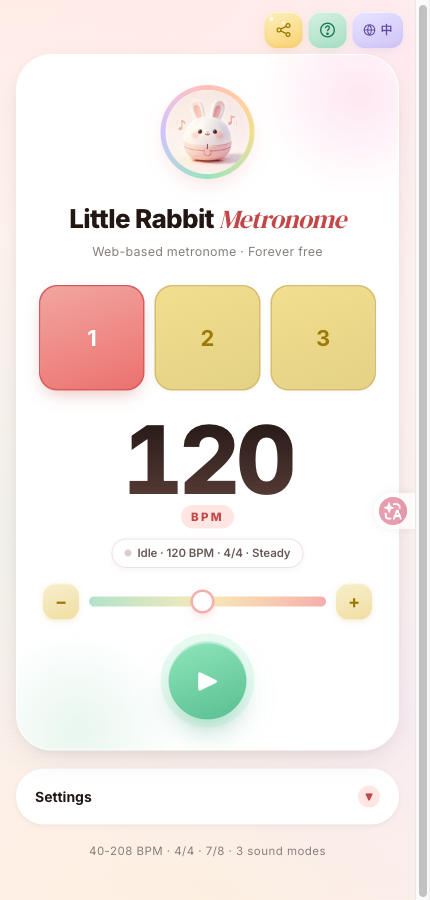
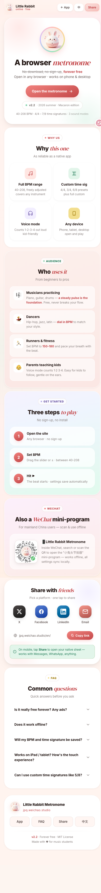
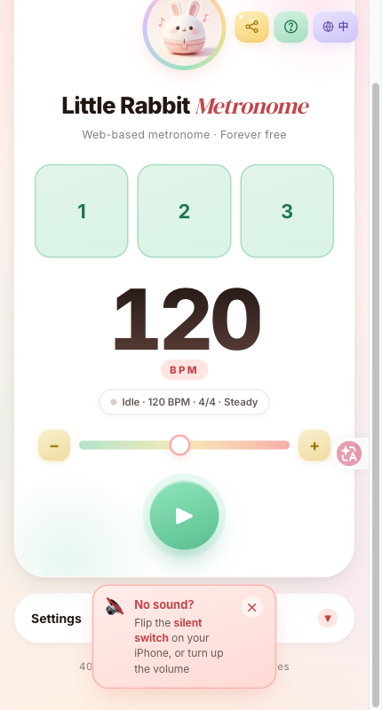

<p align="center">
  
</p>

<p align="center">
  <strong>A metronome that opens in your browser.</strong>
  <br>
  Voice counting, traditional strong/weak beats, multiple time signatures. For piano, drums, dance practice.
</p>

<p align="center">
  <a href="https://jpq.weichao.studio/en/">Try it</a>
  ·
  <a href="#quick-start">Quick start</a>
  ·
  <a href="https://jpq.weichao.studio/en/landing.html">Landing page</a>
  ·
  <a href="README.md">中文文档</a>
</p>

<p align="center">
  <a href="LICENSE"></a>
  
  
  
  
  
</p>

<br>

<p align="center">
  
</p>

---

## See it in action

Two things ruin practice: **unstable tempo** and **losing count**. This app handles both — rock-solid timing by default, and a voice mode that counts beats for you when you drift.

<p align="center">
  
</p>

<p align="center">
  <em>Landing page — "A browser metronome that actually keeps up."</em>
</p>

<br>

<p align="center">
  
</p>

<p align="center">
  <em>iPhone silent-mode hint — iOS won't expose the ringer switch, so we just ask once on first play.</em>
</p>

---

## TL;DR

- 🥁 **Three sounds** — traditional strong/weak, uniform pitch, voice counting (perfect for beginners)
- 🎚️ **40 – 208 BPM** — slider responds live, no need to pause
- ⏱️ **2/4 · 3/4 · 4/4 · 6/8** — presets plus any custom numerator/denominator
- ⌨️ **Keyboard shortcuts** — Space to play/pause, ↑↓ ±1 BPM, Shift+↑↓ ±5 BPM
- 📱 **PWA** — install to home screen, behaves like a native app
- 🐰 **WeChat Mini Program** — also available if you'd rather not open a browser
- 💸 **Core free forever** — no ads, no paywall, default voice counting stays free; web tips plus an optional one-time sound pack on iOS / Android

---

## Why this one?

| You want to… | So you use… | And end up with… |
|---|---|---|
| Add a metronome to piano lessons | A phone app | Install, sign in, watch an ad |
| Help kids count beats | A metronome app | Cold robotic numbers, kids tune out |
| Dial in tempo for drum practice | Desktop software | Tied to one machine, useless on phone |
| Pin down the tempo of a piece quickly | An online tool | Wants login, dies in two years |

Bunny Metronome = **opens in a browser, counts beats out loud, works for piano and drums, runs on phone and laptop**.

---

## Features

### 🥁 Three sound modes

Clicks are short woodblock-style samples (not soft sines). Counts are pre-rendered “one, two, three…” buffers, scheduled on the Web Audio clock.

| Mode | Sound | Best for |
|---|---|---|
| 🥁 **Traditional** | Strong / weak short clicks | Piano, classical, drum fundamentals |
| 🎵 **Uniform** | The same click every beat | Pure tempo work, no accent bias |
| 🗣️ **Voice** | Pre-rendered “one, two, three…” | Kids, beginners, anyone losing count |

Switching takes effect immediately, even mid-playback.

### 🎚️ Live BPM control

- Range **40 – 208 BPM**
- Slider responds **as you drag** — no need to stop
- Master volume in Settings, 10–100%, remembered
- Voice samples share the same audio clock as the clicks — they don't drift late

### ⏱️ Multiple time signatures

Presets: `2/4` `3/4` `4/4` `6/8`

Custom: any numerator/denominator — 5/4, 7/8, 12/8 all work (right-click "Apply" in the settings panel).

### ⌨️ Keyboard shortcuts

Hands on the keyboard? These three are enough:

```
Space          Play / pause
↑ ↓            BPM ±1
Shift + ↑ ↓    BPM ±5
```

Blind operation. Eyes on the sheet.

### 📱 PWA + Mini Program

- **PWA** — `manifest.json` + Service Worker; install to home screen, opens full-screen
- **WeChat Mini Program** — search "小兔头节拍器" inside WeChat
- **Responsive** — phone, tablet, desktop; same code, adapts layout

### 🍎 iPhone silent-mode reminder (heuristic)

iOS won't expose the ringer/silent switch to web pages. On first play, the app pops a one-time prompt:

> **Is your iPhone on silent?** If so, you won't hear anything. Switch it off first.

This is a **heuristic** — we can't actually read the switch state, we just ask. You can dismiss it.

---

## Quick start

Three ways. Pick whichever fits.

### A. Use the hosted demo — zero config

👉 **<https://jpq.weichao.studio/en/>**

Every modern browser works: macOS / Windows / Linux / iPhone / iPad / Android.

### B. Clone and double-click — no server

```bash
git clone https://github.com/toolazytoname/metronome.git
cd metronome
open en/index.html      # macOS
xdg-open en/index.html  # Linux
start en\index.html     # Windows
```

Serve it over HTTP (`python3 -m http.server`). Sample files need a real origin — `file://` may fail to fetch audio (the engine falls back to a synthesized click).

### C. Self-host on your own URL

```bash
# Vercel (zero config, free HTTPS)
npx vercel --prod

# GitHub Pages
# Settings → Pages → Deploy from branch → main / root

# Cloudflare Pages
# Connect repo → Build command empty → Output dir root
```

Full walkthrough in **[DEPLOY.md](DEPLOY.md)**.

---

## How it works

```
   ┌──────────────────────────────────────────────────────┐
   │  index.html + js/engine.js   (zero deps, no build)   │
   └─────────────────┬────────────────────────────────────┘
                     │
                     │  runs entirely client-side
                     ▼
   ┌──────────────────────────────────────────────────────┐
   │  Web Audio API    lookahead scheduler                │
   │  Click samples + pre-rendered counts                 │
   │  localStorage     BPM / meter / sound / volume       │
   └─────────────────┬────────────────────────────────────┘
                     │
                     │  optional
                     ▼
   ┌──────────────────────────────────────────────────────┐
   │  Umeng + GA4      anonymous event analytics          │
   │  Service Worker   offline cache                      │
   │  manifest.json    PWA install                        │
   └──────────────────────────────────────────────────────┘
```

**Every tick, in the browser:**

1. A lookahead scheduler books the next beat ~100ms ahead on `AudioContext.currentTime`
2. At that time it plays the matching sample (strong/weak/uniform click, or one–sixteen)
3. The beat-ball UI pops on the same timestamp
4. Dragging BPM only changes the next interval — it does not fire an extra click

No other steps. No backend. No account system.

---

## Tech stack

| Layer | Tech | Notes |
|---|---|---|
| Frontend | Vanilla HTML + CSS + JS | Zero deps, no build step |
| Audio | Web Audio API + short samples | Lookahead scheduling; synth click fallback |
| Voice | Pre-rendered zh/en count samples | Offline Xiaoyi / Ana renders, not live OS TTS |
| PWA | manifest.json + `sw.js` | Home-screen install + offline cache |
| CN analytics | Umeng CNZZ (site ID 1281476758) | Anonymous events only |
| Global analytics | Google Analytics 4 (G-QH9CD00C0V) | Same |
| WeChat Mini Program | Native mini-program (`miniapp/`) | Shares UI logic with web |
| Deploy | Vercel | Domain `jpq.weichao.studio` |

Everything is in the repo, readable end to end. No black boxes, no SaaS dependencies.

---

## Data format (`localStorage`)

The app stashes its preferences under a single `localStorage` key:

```jsonc
// localStorage key: "metronome"
{
  "bpm": 120,         // 40 - 208
  "bc": 4,            // beats per measure
  "bu": 4,            // beat unit
  "sm": "uniform",    // "traditional" | "uniform" | "voice"
  "vol": 85           // 10 - 100
}
```

That's it. Switch browsers and it resets — no cloud sync. That's the cost (and the appeal) of "open and play."

---

## Privacy

| Aspect | Practice |
|---|---|
| User input | No accounts, no forms, no identity collection |
| Local storage | Only BPM / signature / sound mode (4 fields) |
| Network requests | Umeng + GA4 analytics only (anonymous events) |
| Third-party trackers | None |
| Data sales | None |

If you'd rather not have analytics at all, install uBlock / AdGuard and they'll get cut in one swipe.

---

## Out of scope

The metronome deliberately **doesn't** do:

- **Polyrhythms** (e.g. triplets inside 4/4) — too complex for a web tool
- **Score following** — no MIDI / MusicXML parsing
- **Cloud sync of preferences** — intentionally not; the config is too small to bother
- **Recording / playback** — doesn't record, store, or upload your practice audio
- **Social features** — no leaderboards, no streaks, no friends

If any of those are dealbreakers, you're not the audience — and that's fine. This is for the person who wants a reliable beat for piano/drum practice and doesn't want to be locked into an app.

---

## FAQ

**No sound on iPhone?**
Check the ringer switch. Web pages can't read the silent state — first playback pops a prompt. Same on Apple Watch.

**Is the voice mode a real child?**
No live recording. Counts are pre-rendered samples (Chinese 一、二、三… / English one, two, three…), so every OS sounds the same and they stay on the beat. Re-run `tools/gen-sounds.py` to swap the voice.

**Does it lag at high BPM?**
208 BPM has been stress-tested. The hard cap stays at 208 — above that, even a scheduled click starts to smear into the next beat. The beat clock is a lookahead scheduler, not `setInterval`.

**Can I use it offline?**
Yes (Service Worker caches all static assets). First load online, then it works offline.

**Is there a WeChat Mini Program?**
Yes. Search "小兔头节拍器" in WeChat. Same feature set, UI adapted for mini-program components.

**Can it follow along with a song?**
No. No MIDI input, no audio analysis. For that, use a DAW (Logic, Reaper, Ableton).

---

## Roadmap

- [x] Three sound modes (traditional / uniform / voice)
- [x] BPM 40 – 208 live control
- [x] 2/4 · 3/4 · 4/4 · 6/8 signatures
- [x] Custom numerator/denominator
- [x] Keyboard shortcuts
- [x] iOS silent-mode heuristic hint
- [x] PWA + home-screen install
- [x] WeChat Mini Program
- [x] English + Chinese (`/en/` with hreflang)
- [ ] Native iOS / Android (SwiftUI + Compose, iOS first)
- [ ] One-time store sound pack (default voice stays free)
- [ ] Practice course collab (partnering with a piano education account)

Have an idea? [Open an issue](https://github.com/toolazytoname/metronome/issues).

---

## Development

```bash
git clone https://github.com/toolazytoname/metronome.git
cd metronome
python3 -m http.server 8000
# open http://localhost:8000/en/
```

**Editing the app** — open `index.html` (Chinese) or `en/index.html` (English) in any editor. The `<style>` and `<script>` blocks are at the bottom; extract them into separate files if you prefer to maintain them that way. Multi-platform rules live in [AGENTS.md](AGENTS.md).

**Project layout**

```
index.html               Chinese main app (stays at repo root — do not move)
en/index.html            English main app
js/engine.js             Audio engine (lookahead + samples)
sw.js                    Service Worker
assets/sounds/           Clicks + zh/en count samples (single source)
landing.html             Chinese landing page
en/landing.html          English landing page
manifest.json            PWA config
vercel.json              Deploy config (redirects + cache policy)
scripts/                 Playwright capture + SEO audit scripts
docs/                    Architecture, engine contract, IAP, product
miniapp/                 WeChat Mini Program source
ios/                     SwiftUI + AVAudioEngine (reference impl; backlog in AGENTS.md)
android/                 Compose + AudioTrack (port of the frozen spec)
packages/strings/        Native UI copy
images/                  Logo, QR codes, favicon
assets/screenshots/      README screenshot assets
AGENTS.md                Agent source of truth
CLAUDE.md                Points at AGENTS.md
DEPLOY.md                Deploy walkthrough
robots.txt / sitemap.xml Sitemap
LICENSE                  MIT
```

---

## Contributing

PRs welcome for small, focused improvements. Before opening a PR:

1. Search existing issues / PRs
2. For anything beyond a typo, open an issue first to align on direction
3. Keep the web app zero-dep / no-build. Multi-platform rules live in [AGENTS.md](AGENTS.md)

For security issues, **don't** open a public issue — email <lazywc@gmail.com>.

---

## License

[MIT](LICENSE)

---

<p align="center">
  Built by <a href="https://github.com/toolazytoname">@toolazytoname</a>
  · <a href="mailto:lazywc@gmail.com">lazywc@gmail.com</a>
</p>