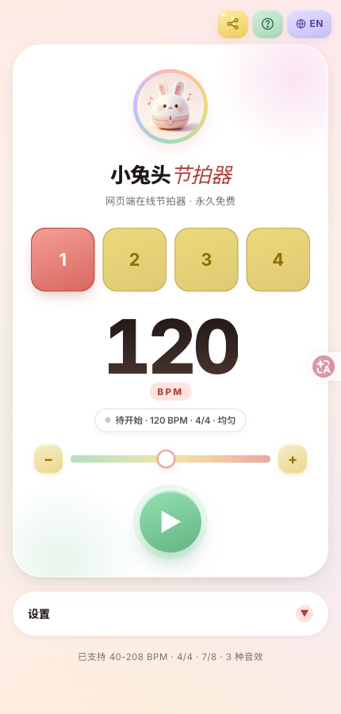
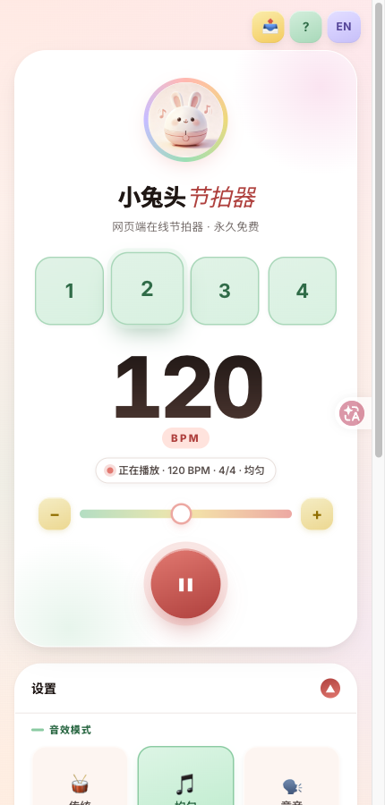
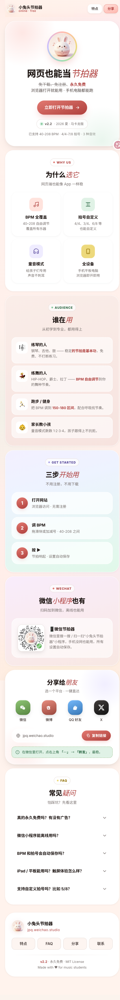
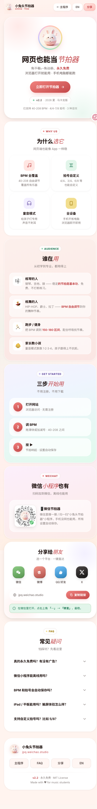

<p align="center">
  
</p>

<p align="center">
  <strong>一个打开浏览器就能用的网页节拍器。</strong>
  <br>
  支持童声数拍、传统强/弱拍、多种拍号。练琴、练鼓、练舞都行。
</p>

<p align="center">
  <a href="https://jpq.weichao.studio">立即体验</a>
  ·
  <a href="#快速开始">快速开始</a>
  ·
  <a href="https://jpq.weichao.studio/landing.html">落地页</a>
  ·
  <a href="README.en.md">English docs</a>
</p>

<p align="center">
  <a href="LICENSE"></a>
  
  
  
  
  
</p>

<br>

<p align="center">
  
</p>

---

## 先看效果

练琴最怕两件事：**节拍不稳**，**数拍走神**。节拍器把这两件事都包了：默认节拍稳，童声模式帮你数拍。

<p align="center">
  
</p>

<p align="center">
  <em>播放状态 —— 设置面板里切音效模式。</em>
</p>

<br>

<p align="center">
  
</p>

<p align="center">
  <em>落地页 —— 「网页也能当节拍器」的全部理由。</em>
</p>

---

## 一分钟版

- 🥁 **三种音效** —— 传统强/弱拍、均匀同音、童声数拍（初学者神器）
- 🎚️ **40 – 208 BPM** —— 滑块实时调节，无需停顿
- ⏱️ **2/4 · 3/4 · 4/4 · 6/8** —— 预设拍号全开，自定义任意分子/分母
- ⌨️ **键盘快捷键** —— Space 播放/暂停、↑↓ ±1 BPM、Shift+↑↓ ±5 BPM
- 📱 **PWA** —— 加到主屏像 App 一样用
- 🐰 **微信小程序** —— 不方便开浏览器？小程序也在
- 💸 **核心永远免费** —— 没广告、没付费墙、默认童声可用；网页自愿打赏，iOS / Android 可选一次买断的额外音色

---

## 为什么是它？

| 你想做的事 | 以前只能用… | 结果是… |
|---|---|---|
| 给钢琴课配个节拍器 | 手机 App | 要装、要登录、要被广告打扰 |
| 给孩子数拍启蒙 | 节拍器 App | 数字读音冷冰冰，孩子不爱听 |
| 练鼓找准速度 | 桌面软件 | 一台电脑锁死，手机用不了 |
| 临时给一段曲子定拍 | 在线工具 | 要联网、要账号、过两天跑路 |

小兔头节拍器 = **浏览器打开就有，童声数拍，钢琴鼓都能用，手机电脑都能开**。

---

## 功能

### 🥁 三种音效模式

鼓点是短促的木鱼式采样（不是软正弦），童音是预先渲好的「一、二、三…」采样，用 Web Audio 按拍点预约播放。

| 模式 | 怎么响 | 适合 |
|---|---|---|
| 🥁 **传统** | 强拍 / 弱拍两套短 click | 钢琴、古典、鼓的基本功练习 |
| 🎵 **均匀** | 每拍同一声 click | 稳定节奏感训练，不被强/弱干扰 |
| 🗣️ **童音** | 预渲染采样念出「一、二、三、四…」 | 启蒙、儿童练琴、初学者数拍 |

切换即时生效，播放中也能换。

### 🎚️ BPM 实时调节

- 范围 **40 – 208 BPM**
- 滑块拖动**边拖边变**，不用停下
- 设置里有总音量，10–100%，会记住
- 童音是预渲染采样，和鼓点走同一套音频时钟，不会越念越晚

### ⏱️ 多种拍号

预设：`2/4` `3/4` `4/4` `6/8`

自定义：任意分子/分母组合 —— 5/4、7/8、12/8 都行（设置面板右键「应用」进调试模式）。

### ⌨️ 键盘快捷键

不想动鼠标？记住这三个：

```
Space          播放 / 暂停
↑ ↓            BPM ±1
Shift + ↑ ↓    BPM ±5
```

不用看屏幕，调速盲操都够用。

### 📱 PWA + 小程序

- **PWA**：`manifest.json` + Service Worker，加到手机主屏像原生 App
- **微信小程序**：搜索「小兔头节拍器」，不想开浏览器就用小程序
- **响应式**：手机 / 平板 / 桌面，同一套代码自适应

### 🍎 iPhone 静音提醒（启发式）

iOS 不让网页读静音开关，所以节拍器会在用户首次播放时弹出提示：

> **手机开了静音吗？** 开了的话你听不到，先关掉再继续。

这是**启发式** —— 我们不知道你手机到底什么状态，只能提醒一下。不想看到这个提示可以关掉。

<p align="center">
  
</p>

---

## 快速开始

三种方式，挑一个顺手的。

### A. 直接用线上版 —— 零配置

👉 **<https://jpq.weichao.studio>**

所有现代浏览器都行：macOS / Windows / Linux / iPhone / iPad / Android。

### B. Clone 后双击打开 —— 不需要服务器

```bash
git clone https://github.com/toolazytoname/metronome.git
cd metronome
open index.html           # macOS
xdg-open index.html       # Linux
start index.html          # Windows
```

本地请用 `python3 -m http.server` 打开。采样要走 HTTP，`file://` 下 fetch 音频可能失败（引擎会回退到合成 click）。

### C. 自托管到你自己的域名

```bash
# Vercel（零配置，免费 HTTPS）
npx vercel --prod

# GitHub Pages
# Settings → Pages → Deploy from branch → main / root

# Cloudflare Pages
# Connect repo → Build command 留空 → Output dir 留根目录
```

完整流程见 **[DEPLOY.md](DEPLOY.md)**。

---

## 工作原理

```
   ┌──────────────────────────────────────────────────────┐
   │  index.html + js/engine.js   （零依赖，无构建步骤）   │
   └─────────────────┬────────────────────────────────────┘
                     │
                     │  纯前端运行
                     ▼
   ┌──────────────────────────────────────────────────────┐
   │  Web Audio API    lookahead 预约下一拍               │
   │  采样 click + 预渲染数拍                             │
   │  localStorage     记住 BPM / 拍号 / 音效 / 音量      │
   └─────────────────┬────────────────────────────────────┘
                     │
                     │  可选
                     ▼
   ┌──────────────────────────────────────────────────────┐
   │  友盟统计 + GA4    匿名事件统计（播放/暂停/调节）    │
   │  Service Worker    离线缓存                          │
   │  manifest.json     PWA 安装                          │
   └──────────────────────────────────────────────────────┘
```

**每个 tick，在浏览器里：**

1. 用 `AudioContext.currentTime` 提前约 100ms 预约下一拍（lookahead scheduler）
2. 到点播放对应采样（强/弱/均匀 click，或「一」到「十六」）
3. 节拍球 UI 按同一时刻闪烁
4. 拖 BPM 只改下一拍间隔，不会额外打一拍

没别的步骤。没有后端。没有账号体系。

---

## 技术栈

| 层次 | 技术 | 备注 |
|---|---|---|
| 前端 | 原生 HTML + CSS + JS | 零依赖，无构建步骤 |
| 音频 | Web Audio API + 短采样 | lookahead 预约；采样失败时回退合成 click |
| 童音 | 预渲染中文/英文数拍采样 | 晓伊 / Ana 神经音色离线渲好，不走系统 TTS |
| PWA | manifest.json + `sw.js` | 加到主屏，静态资源离线可开 |
| 国内统计 | 友盟 CNZZ（site ID 1281476758） | 仅埋点，不收集个人数据 |
| 海外统计 | Google Analytics 4（G-QH9CD00C0V） | 同上 |
| 微信小程序 | 原生小程序（`miniapp/` 目录） | 复用同一套 UI 逻辑 |
| 部署 | Vercel | 域名 `jpq.weichao.studio` |

所有代码都在仓库里可读 —— 没有黑盒、没有 SaaS 依赖。

---

## 数据格式（`localStorage`）

节拍器把偏好存在 `localStorage` 一个 key 下：

```jsonc
// localStorage key: "metronome"
{
  "bpm": 120,         // 40 - 208
  "bc": 4,            // 拍号分子（beats per measure）
  "bu": 4,            // 拍号分母（beat unit）
  "sm": "uniform",    // "traditional" | "uniform" | "voice"
  "vol": 85           // 10 - 100
}
```

就这点东西。换个浏览器就重置，没有任何云同步 —— 这就是「打开即用」的代价，也是它的简单。

---

## 隐私

| 维度 | 做法 |
|---|---|
| 用户输入 | 没有账号、没有表单、不收集任何身份信息 |
| 本地存储 | 只存 BPM / 拍号 / 音效偏好（4 个字段） |
| 网络请求 | 仅友盟 + GA4 统计（埋点，不带个人信息） |
| 第三方追踪 | 无 |
| 数据出售 | 无 |

如果连埋点都不想要，浏览器装个 uBlock / AdGuard 一刀切就完事。

---

## 不在范围内

节拍器明确**不**做：

- **多轨 / 复合节奏**（比如 4 拍里加三连音） —— 太复杂，网页做意义有限
- **谱例跟随** —— 不做 MIDI / MusicXML 解析
- **云端同步偏好** —— 故意不做，浏览器之间没必要同步这点配置
- **录课 / 回放** —— 不录、不存、不上传你的练习音频
- **社交功能** —— 不做排行榜、不做打卡、不做好友

以上是硬需求的话你不是目标用户 —— 这没问题。节拍器服务的是「想练琴/练鼓，需要一个靠谱的拍子，不要被 App 绑架」的人。

---

## 常见问题

**iPhone 上没声音？**
检查静音开关。Web 端没法读静音状态，第一次播放会弹出提示问一次。Apple Watch 的话同样确认手表没静音。

**童音模式是真人吗？**
不是现场录音。数拍是离线渲好的固定采样（中文「一、二、三…」，英文 one, two, three…），所以各系统听起来一样，也不会越念越晚。想换声线可以重跑 `tools/gen-sounds.py`。

**BPM 调到极限会卡吗？**
208 BPM 极限测试过没问题。再往上即使按音频时钟预约，拍点也会糊进下一拍，所以上限卡 208。

**能离线用吗？**
能（Service Worker 缓存了所有静态资源）。首次打开后断网也能用。

**有小程序版吗？**
有。微信搜「小兔头节拍器」。功能跟网页版一致，UI 适配小程序组件。

**能跟着曲子定拍吗？**
不能。没有 MIDI 输入、没有音频分析。要这种功能建议用专门的 DAW（Logic、Reaper、Ableton）。

---

## 路线图

- [x] 三种音效模式（传统 / 均匀 / 童声）
- [x] BPM 40 – 208 实时调节
- [x] 2/4 · 3/4 · 4/4 · 6/8 拍号
- [x] 自定义分子/分母
- [x] 键盘快捷键
- [x] iOS 静音启发式提示
- [x] PWA + 加到主屏
- [x] 微信小程序
- [x] 中英双语（`/en/` 目录 + hreflang）
- [ ] iOS / Android 双原生（SwiftUI + Compose，先 iOS）
- [ ] 商店一次性音色包（默认童声仍免费）
- [ ] 节拍器练习课程（与某钢琴教育账号合作中）

有想法？[开个 issue](https://github.com/toolazytoname/metronome/issues)。

---

## 开发

```bash
git clone https://github.com/toolazytoname/metronome.git
cd metronome
python3 -m http.server 8000
# 打开 http://localhost:8000
```

**改 App** —— 任何文本编辑器打开 `index.html`。`<style>` 和 `<script>` 在文件底部；想拆分维护就抽出来。多端规则见 [AGENTS.md](AGENTS.md)。

**目录结构**

```
index.html               中文版主应用（Web 留在仓库根，不要搬家）
en/index.html            英文版主应用
js/engine.js             音频引擎（lookahead + 采样播放）
sw.js                    Service Worker
assets/sounds/           click + 中/英数拍采样（各端唯一来源）
landing.html             中文落地页
en/landing.html          英文落地页
manifest.json            PWA 配置
vercel.json              部署配置（重定向 + 缓存策略）
scripts/                 本地体检脚本
docs/                    架构、引擎契约、IAP、产品说明
miniapp/                 微信小程序源码
ios/                     SwiftUI + AVAudioEngine（建设中）
android/                 Compose + AudioTrack（iOS 冻结后）
packages/strings/        原生 UI 文案表
images/                  Logo、二维码、favicon
assets/screenshots/      README 截图素材
AGENTS.md                Agent 真相源
CLAUDE.md                指向 AGENTS.md
DEPLOY.md                部署流程
robots.txt / sitemap.xml 站点地图
LICENSE                  MIT
```

---

## 贡献

欢迎小而专注的 PR。提 PR 之前：

1. 搜一下已有 issue / PR
2. 超过 typo 范围的，先开个 issue 对齐方向
3. Web 守住「零依赖、无构建」—— 不加框架。多端规则以 [AGENTS.md](AGENTS.md) 为准

安全问题**别**开公开 issue —— 邮件 <lazywc@gmail.com>。

---

## License

[MIT](LICENSE)

---

<p align="center">
  Built by <a href="https://github.com/toolazytoname">@toolazytoname</a>
  · <a href="mailto:lazywc@gmail.com">lazywc@gmail.com</a>
</p>