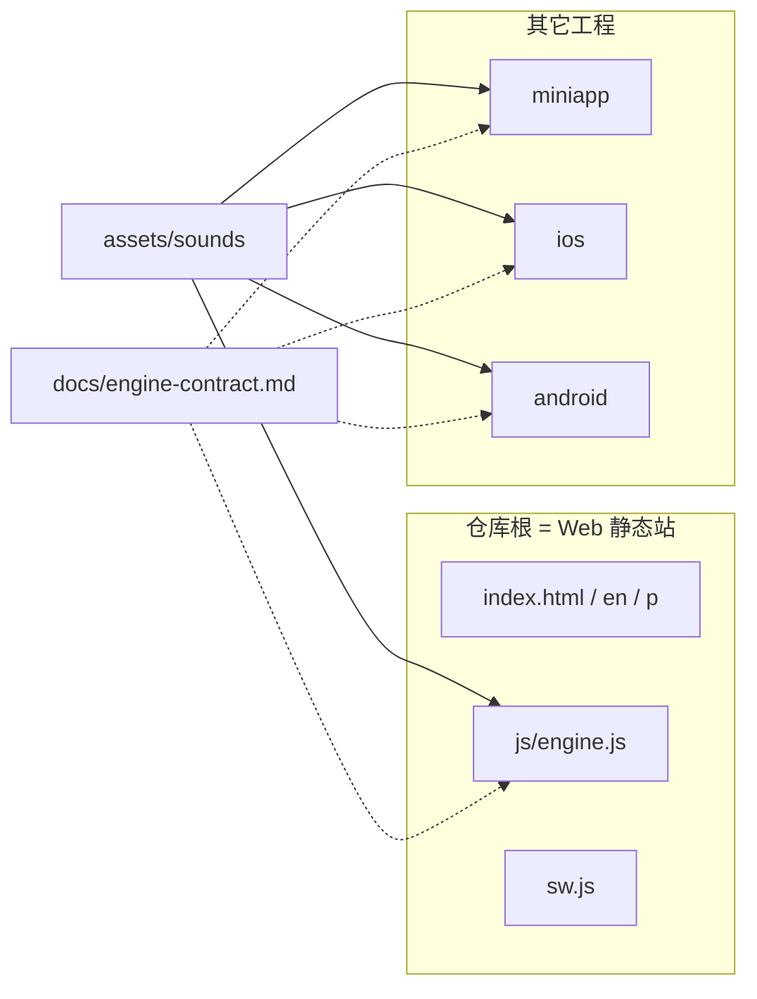

# 架构

小兔头节拍器是一个**无后端**的多端产品。共享的是采样、状态契约、品牌和文案，不是一份跨端时钟实现。

约束见 [AGENTS.md](../AGENTS.md)。拍钟数字见 [engine-contract.md](./engine-contract.md)。赚钱见 [product-and-monetization.md](./product-and-monetization.md) 和 [iap.md](./iap.md)。

## 端

| 端 | 为什么独立 | 时钟 |
|---|---|---|
| Web | SEO、长尾、零构建、打开即用 | `AudioContext.currentTime` lookahead（25ms / 0.1s） |
| 小程序 | 微信分发；无 AudioWorklet；切后台必停 | `Date.now()` + `setTimeout` 绝对时刻 + InnerAudio 池 |
| iOS | 静音键、锁屏、StoreKit | `AVAudioEngine` 预约，`AVAudioSession` **`.playback`** |
| Android | 厂商杀后台、Play Billing | `AudioTrack` / AAudio + 前台 Service |

v1 不上共享 C++ / KMP 引擎。漂移成为问题再抽。

## 为什么 Web 留在根上

- Vercel 按仓库根发布
- `sw.js` 预缓存 `/js/engine.js`、`/assets/sounds/...`
- 规范 URL：`/`、`/en/`、`/p/piano-practice.html`、`/about`
- 小程序 donate 深链到 `https://jpq.weichao.studio/about#donate`

搬到 `apps/web/` 只是目录好看，会同时改部署、SW、sitemap、hreflang。不要搬。

## 数据

没有服务器。偏好是一份小 JSON，见契约。分析：Web 友盟 CNZZ + GA4；小程序 `umtrack-wx`；原生 v1 **默认不上统计**。

## 视觉 token（原生对照用）

Web 在 `index.html` 的 `:root` 里用 oklch 马卡龙色。原生不要 1:1 搬 CSS，但应靠近：

| Token | 大约 |
|---|---|
| 背景 | 暖米 `oklch(98% 0.022 35)` |
| 珊瑚 / 主按钮 | `oklch(74% 0.165 22)` |
| 墨色文字 | `oklch(22% 0.025 30)` |
| 圆角 | 大卡片 ~24px，豆子全圆 |
| 吉祥物 | `images/bunny.png` |

App 是练琴屏（大 BPM、豆子、播放），不是把落地页塞进手机。

## 发布面

| 路径 | 谁消费 |
|---|---|
| 根静态文件 | Vercel |
| `miniapp/` | 微信开发者工具，Vercel 忽略 |
| `ios/` `android/` | Xcode / Gradle，Vercel 忽略 |
| `docs/` | 人与 Agent，不上线 |

## 建设顺序

1. 仓库与文档（本阶段）
2. iOS 做成参考实现并冻结说明书
3. Android 按说明书移植，不许加功能
